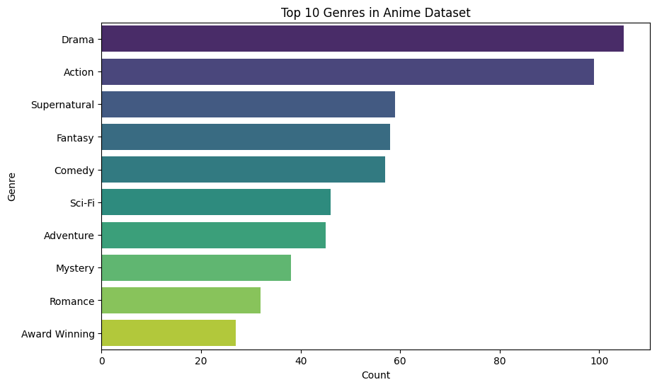
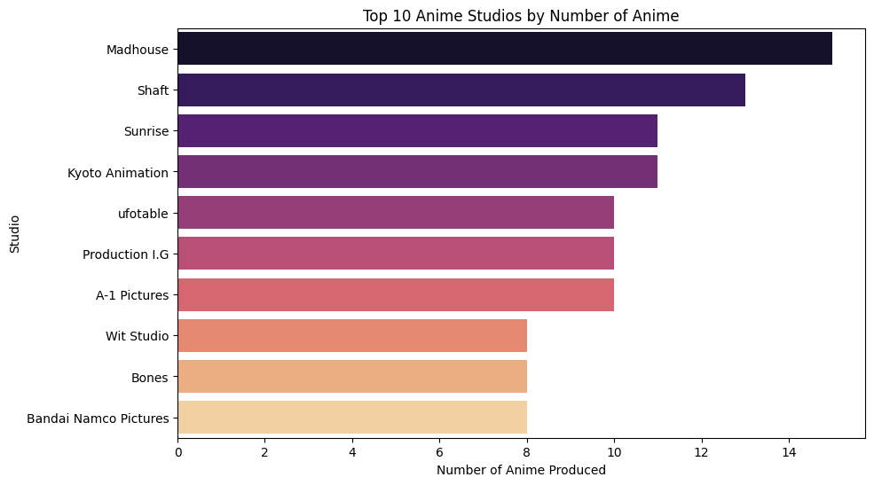
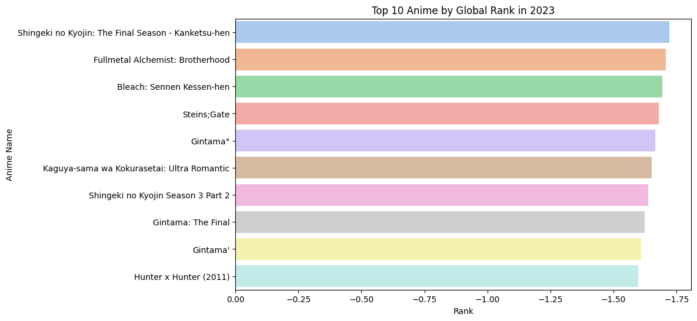
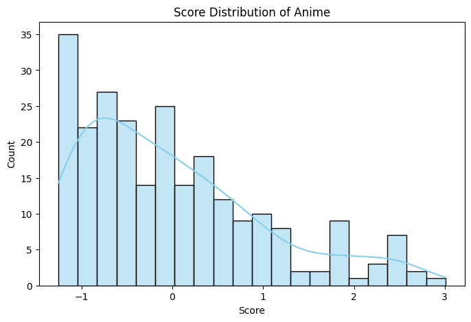
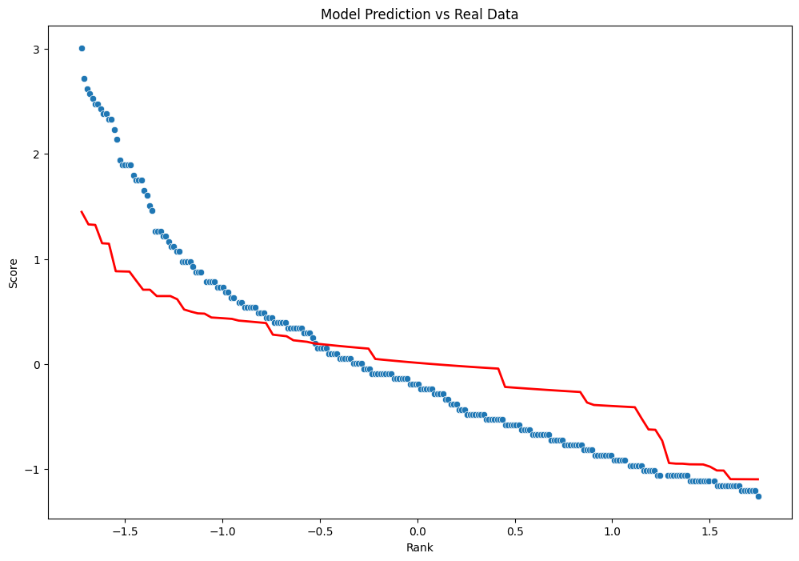
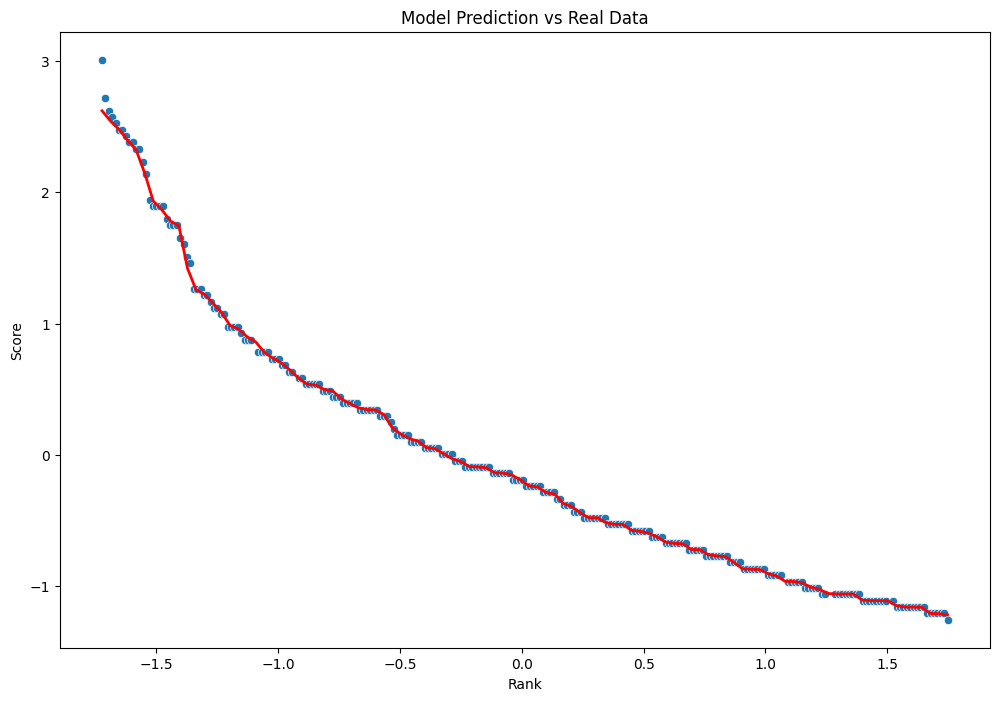
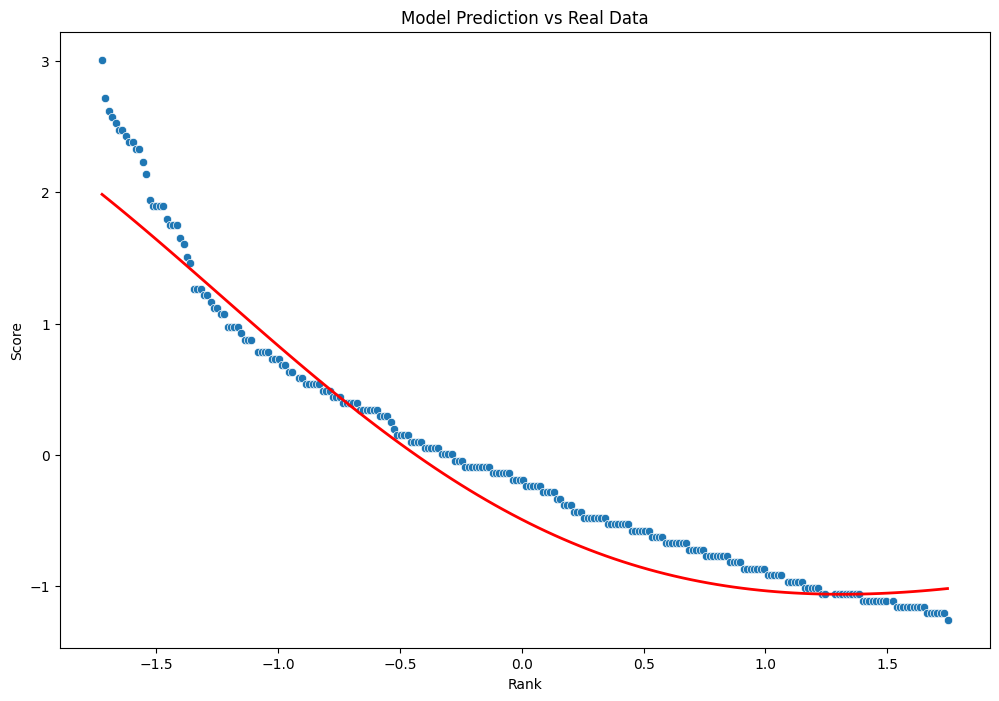

<!DOCTYPE html>
<html lang="en">
<head>
    <meta charset="UTF-8" />
    <meta name="viewport" content="width=device-width, initial-scale=1" />
</head>
<body>
    <h1>Anime Rating Prediction</h1
    <h2>Overview</h2>
    

        This project implements a machine learning model to predict anime ratings based on various features. The goal is to build a model that can accurately estimate the likely rating of an anime.
    

    <h2>Features</h2>
    <ul>
        <li>Utilizes multiple machine learning models including KNN, RandomForest, and SVM</li>
        <li>Data preprocessing including cleaning and feature transformation</li>
        <li>Custom function for rating prediction</li>
        <li>Model evaluation using error metrics</li>
    </ul>
    <h2>Requirements</h2>
    <ul>
        <li>Python 3.x</li>
        <li>pandas</li>
        <li>scikit-learn</li>
        <li>numpy</li>
    </ul>
    
Install the required libraries with:

    <pre><code>pip install pandas scikit-learn numpy</code></pre>
    <h2>How to Run</h2>
    <ol>
        <li>Prepare the anime dataset (or use the sample data provided).</li>
        <li>Run the main script:
            <pre><code>python main.py</code></pre>
        </li>
        <li>The models will be trained, and rating predictions for sample inputs will be displayed.</li>
    </ol>
    <h2>Sample Output</h2>
    <pre><code>Input: Anime features
Predicted Rating: 8.5
</code></pre>
</body>
</html>

<figure>

  <figcaption style="text-align: center;">SVR ScatterPlot</figcaption>
</figure>

